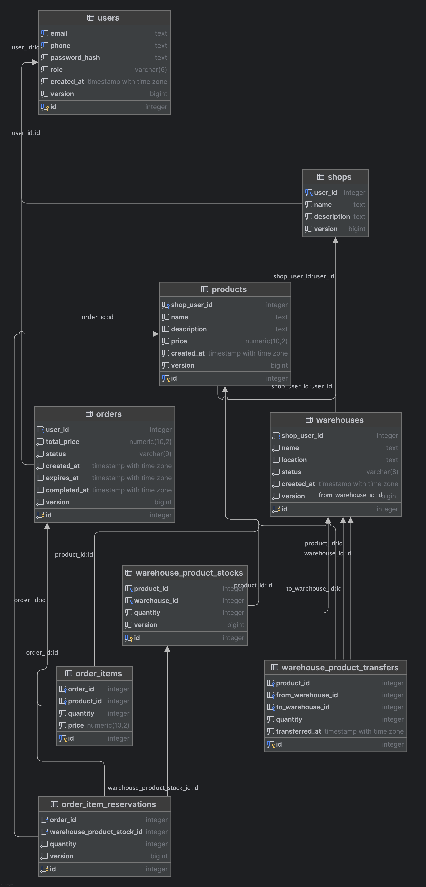

# GO-WAREHOUSE-API
**GO-WAREHOUSE-API** is a project built to meet the challenge of the Senior Back End Engineer Take Home Test. This repository implements a simplified warehouse management system using Go, designed to demonstrate key back-end engineering skills, including handling real-world scenarios such as stock tracking, inventory management, and building APIs.

### Key Features:
1. **User Service:** Simple authentication system allowing users to log in using either phone or email.

2. **Product Service:** API to list products, including stock availability, retrieving product information from the database.

3. **Order Service:**

   1. Checkout and Stock Deduction: Manages the checkout process, reserving product stock and ensuring stock isn’t oversold.
   2. Stock Release: A mechanism to release reserved stock if payment is not completed within a specified time frame, implemented via a background job or timer.

4. **Shop Service:** Each shop can manage one or more warehouses.

5. **Warehouse Service:**

   1. Stock Management: Manages stock quantities per warehouse.
   2. Transfer Products: Allows stock transfers between warehouses, ensuring accurate updates to stock levels.
   3. Active/Inactive Warehouses: Tracks warehouse statuses, excluding inactive warehouses from available stock counts.

### Common Considerations:

1. **Concurrency and Locking:** Implemented to ensure data consistency when multiple users access and modify stock simultaneously.
2. **Monitoring and Logging:** Tracks system activities and logs errors for better system oversight.
3. **Error Handling:** Robust error handling to gracefully manage failures.
4. **Testing:** Includes comprehensive unit, integration, and end-to-end tests.
5. **Scaling:** Designed with horizontal scaling in mind to handle increased traffic and data volumes.
6. **Deployment and Containerization:** Uses containerization techniques (e.g., Docker) and can be managed using orchestration tools like Kubernetes.

## Architecture

### High-Level Design (HLD)


### Database Schema



## Running the Service

To get the **GO-WAREHOUSE-API** up and running on your local machine, follow the steps below:

### 1. Clone the Repository
Start by cloning the repository:
```bash
git clone https://github.com/bearaujus/go-warehouse-api.git go-warehouse-api
```

### 2. Navigate to the Project Directory
Move into the project directory:
```bash
cd go-warehouse-api
```

### 3. Set Up Environment Variables
You need to create a copy of the `.env.example` file and name it `.env` in the `etc/files/` directory:
```bash
cp etc/files/.env.example etc/files/.env
```

### 4. (Optional) Customize Environment Variables
Feel free to adjust the environment variables to suit your needs. You can modify the `.env` file using your favorite text editor:
```bash
nano etc/files/.env
```

### 5. (Optional) Install Makefile
If you haven’t installed [Make](https://www.gnu.org/software/make/manual/make.html) yet, you can install it using the following commands:
```bash
sudo apt update
sudo apt install make
```

### 6. Run the Application
Finally, you can run the application using `make` commands:

- To start the application in the background:

```bash
make up
```

- To stop the application:

```bash
make down
```

### 7. Debugging
After you started the service, you can see the log files at:
```bash
build/log/postgres-master.log
build/log/postgres-replica-1.log
build/log/postgres-replica-2.log
build/log/postgres-replica-3.log
build/log/redis.log
build/log/service-order.log
build/log/service-product.log
build/log/service-shop.log
build/log/service-user.log
build/log/service-warehouse.log
```

## Using the Service

You can explore the API via Postman. Full API documentation is available here: [API Spec](https://documenter.getpostman.com/view/37777109/2sAXjNZWt5).


---

Made with ❤️ by [bearaujus](https://www.linkedin.com/in/bearaujus/) © 2024

---
